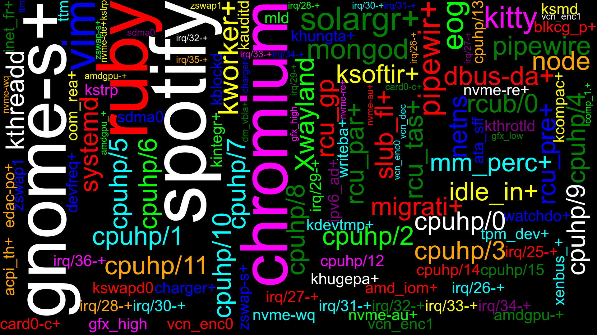

# Process Wallpaper

Create wallpaper image based on the processes running on the system.

## Gems Needed

- [rmagick](https://rubygems.org/gems/rmagick)

## Still a WIP

- It takes about 90 seconds to generate the image on my system.
- The algorithm needs to be optimized to generate image faster.
- The placement of words needs to be optimized.
- The code is a mess. Needs to be refactored.
- Need to automate the process of applying the wallpaper after generation.

### Sample Output

